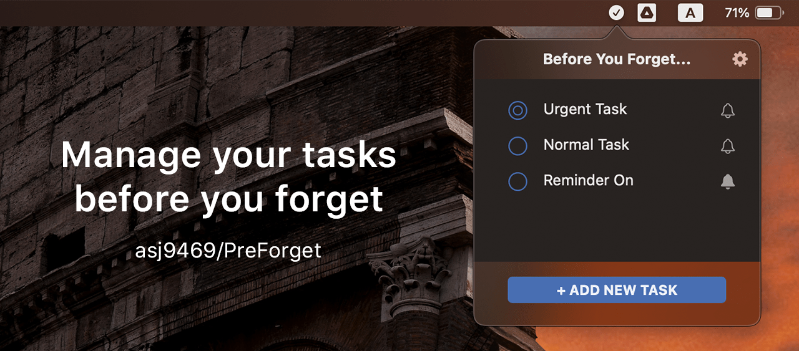

# PreForget: Before You Forget  

## *Update (June 7th): Now Downloadable on the Mac App Store*

PreForget is an interactive macOS menu bar app that was designed to help users easily manage their tasks.

The user friendly UI/UX helps keep away the boredom while conditioning the user to feel positive emotions when doing something that is traditionally "boring."

# Table of Contents
- [Demo](#demo)
- [Screenshots](#screenshots)
  - [Empty List Messages](#empty-list-messages)
  - [Live Response to User Input](#live-response-to-user-input)
- [Features](#features)
- [How to Run the Project File (for now)](#how-to-run-the-project-file-for-now)
- [Future Plans](#future-plans)

## Demo

Add New Tasks | Manage Tasks
:--------:|:--------------------:
|

Settings & Notifications|
:-------------:

## Screenshots
### Empty List Messages (there are more than 2)
Ex 1| Ex 2
:--------:|:----------------:
 | 

### Live Response to User Input (there are more than 1)
Secret Message Example|
:-------------:

## Features
- random "fun" messages when there are no tasks
- live response to negative input such as "no"
- remind feature that notifies users of tasks on a set time
- customizable UI colors and notification banner image
- two-finger swipe to delete task

## How to Run the Project File (for now)
- clone this repository on your MacBook
- open the cloned files via XCode
- run the app

## Future Plans
- ~~app logo design~~
- publish the app on the App Store
- create a demo presentation video
- implement AI to generate new messages
- create a complementary iOS app
- implement CloudKit for task storage for cross-platform integration